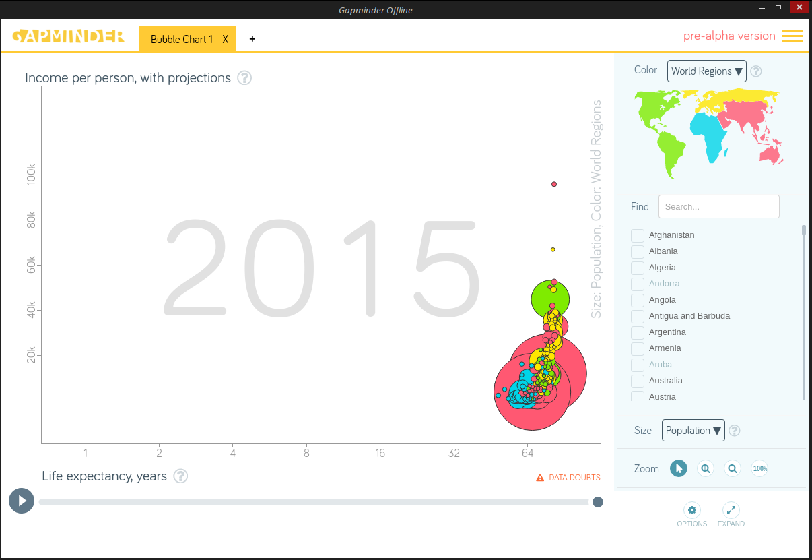

# Vizabi Offline user guide 

## Start

You can get `Vizabi Offline` from [here](https://drive.google.com/open?id=0B88E9aDrKRrLR1A0bHNTRXFBaWM).

There are 4 options:

 * `chrome-app.crx` - chrome extension
 * `Vizabi Offline-linux-x64` - electron application for Linux
 * `Vizabi Offline-darwin-x64` - electron application for MacOS
 * `Vizabi Offline-win32-x64` - electron application for Windows
 
### Install and run chrome extension

 * download `chrome-app.crx`
 * Go to `Chrome Settings`->`Extensions`
 * Drag the application from its folder and drop it to your `extensions area` (in `Chrome`)
 * Find and run `Apps Launcher` in `Chrome`
 * Find and run this extension under `Apps Launcher`

### Install and run Electron application

 * download expected application (in accordance with you platform)
 * unpack it and after you can see new folder that contain `Electron application`
 * run `Vizabi Offline` application under this folder

You will see next screen after `Electron application` start:

This solution supports more than one chart: one tab - one chart. Push `+` button at the top of the screen to create a new tab:

You can change a measure for new tab freely in accordance with `Vizabi` functionality.

The result will be:

At the right top corner you can see menu. Now only one option is available: `Load DDF folder option`

`Load DDF form` is:

New chart in current (new) tab will be created after form filling. Let's try to create `Bubble Map`:

New tab with `Bubble Map` was created:

By the way, you can delete any tab freely by means of `X` on the tab.

## Chrome extension specific

Generally Chrome extension functionality is similar to Electron application functionality. But there is one difference which is due to `Chrome extension` file system specific.
`Chrome extension` can process files in two modes:

* under extension's root
* any file on disk

Because `under extension's root` mode hasn't differences with `Electron application` functionality, let's describe another mode. 

First of all we should run `Chrome extension`:

At the first blush this form has not any difference from similar Electron's form. General difference is: `DDF path type` radio button.

Next one difference - `Custom DDF folder` label and available `Select root folder` button.
We should select custom DDF folder on disk in case of `External DDF path type`.

Dialog for folder selection will be raised.

We will see selected folder to the right of `Custom DDF folder` label and available `Go` button at the bottom of the dialog.

Chart by data that custom folder contains was created:

Next screenshot describes wrong `Custom DDF folder` selection:

This message will be raised during wrong `Custom DDF folder` applying attempt.

